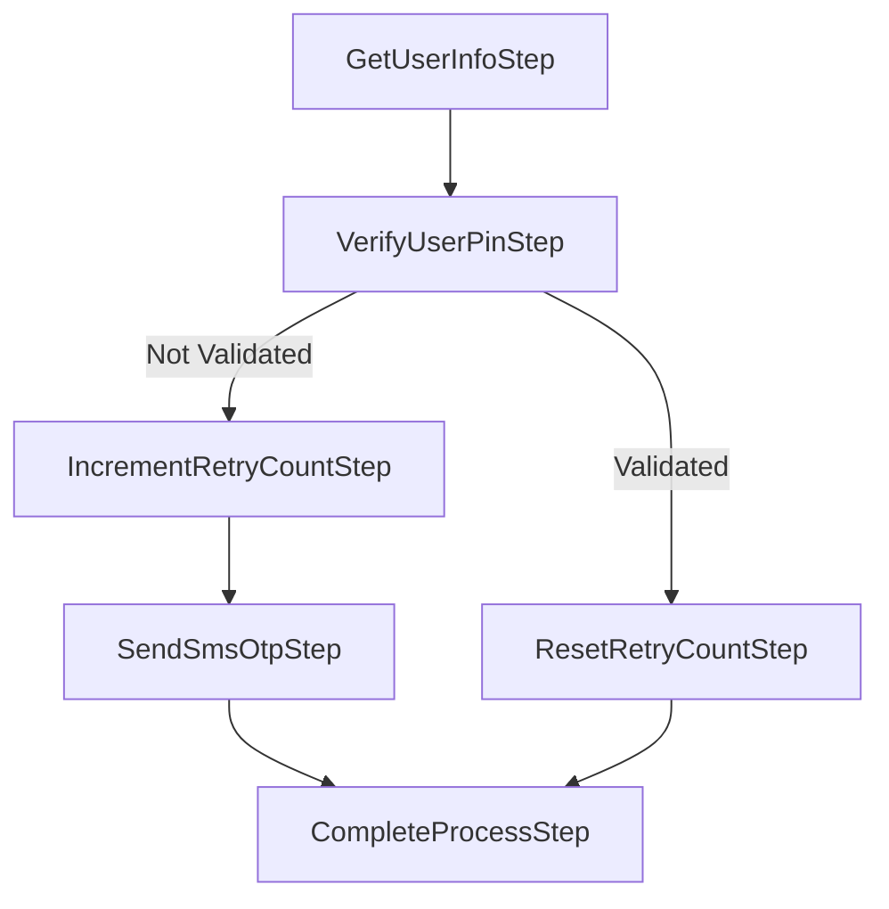

RoseLine pipelines are not required to execute all at once. You can call `ExecuteAsync()` after an initial batch of steps, inspect the state of the bag, add a different set of follow-on steps depending on what you find, and then call `ExecuteAsync()` again. The pipeline resumes from the step after the last one it ran—earlier steps are never repeated.

## How branching works

The `Pipeline` class tracks its position with `CurrentStepIndex`. Each time a step completes successfully, `CurrentStepIndex` is incremented. When you call `ExecuteAsync()` a second time, the loop starts at `CurrentStepIndex`, so only the newly added steps run.

This gives you a natural way to express conditional workflows entirely in ordinary C# code, without any special branching primitives built into the framework.

## Example: PIN verification with retry path

The following diagram shows a workflow where the steps taken after PIN verification depend on whether the PIN was valid.



The first `ExecuteAsync()` call runs `GetUserInfoStep` and `VerifyUserPinStep`. After that, the bag's `IsPinVerified` flag tells you which branch to take. You add the appropriate steps and call `ExecuteAsync()` again to finish.

<Note>
This example uses an extended bag with an `IsPinVerified` property to illustrate the branching pattern. In your own project, define the appropriate properties on your bag subtype to carry the intermediate state your branching logic needs.
</Note>

```csharp
class Program
{
    static async Task Main(string[] args)
    {
        var bag = new ExampleBag { Users = [], IsPinVerified = false };

        var pipeline = new Pipeline<ExampleBag, CustomError>(bag);

        pipeline.AddStep(new GetUserInfoStep());
        pipeline.AddStep(new VerifyUserPinStep());

        // Run the first two steps
        var halfResult = await pipeline.ExecuteAsync();

        if (!halfResult.IsSuccess)
        {
            Console.WriteLine(
                $"Step: {halfResult.Error.Step}, " +
                $"IsUnHandledError: {halfResult.Error.IsUnhandledError}, " +
                $"Code: {halfResult.Error.Code}");
            return;
        }

        // Branch based on the intermediate bag state
        if (!halfResult.Bag.IsPinVerified)
        {
            pipeline.AddStep(new IncrementRetryCountStep());
            pipeline.AddStep(new SendSmsOtpStep());
        }
        else
        {
            pipeline.AddStep(new ResetRetryCountStep());
        }

        // Both branches converge here
        pipeline.AddStep(new CompleteProcessStep());

        // Resume — only the newly added steps execute
        var result = await pipeline.ExecuteAsync();

        if (!result.IsSuccess)
        {
            Console.WriteLine(
                $"Step: {result.Error.Step}, " +
                $"IsUnHandledError: {result.Error.IsUnhandledError}, " +
                $"Code: {result.Error.Code}");
            return;
        }

        Console.WriteLine(string.Join(",", result.Bag.Users));
    }
}
```

## How `CurrentStepIndex` tracks progress

`CurrentStepIndex` starts at `0` and is incremented after each step completes without error. On the second call to `ExecuteAsync()`, the `for` loop inside the pipeline begins at `CurrentStepIndex`, so steps that already ran are skipped automatically.

```csharp
// After the first ExecuteAsync(), CurrentStepIndex == 2
// Steps[0] = GetUserInfoStep   (already ran)
// Steps[1] = VerifyUserPinStep (already ran)
// Steps[2] = IncrementRetryCountStep  <-- execution resumes here
// Steps[3] = SendSmsOtpStep
// Steps[4] = CompleteProcessStep
```

<Warning>
Always check `IsSuccess` on the intermediate result before adding more steps and calling `ExecuteAsync()` again. If an earlier step failed, `CurrentStepIndex` points to the failed step. Calling `ExecuteAsync()` with a prior error in place will return the error immediately without running any new steps.
</Warning>

<Note>
Steps added to the pipeline at an index below `CurrentStepIndex` are skipped on re-execution. Only steps at index `CurrentStepIndex` or higher are run on a subsequent call to `ExecuteAsync()`.
</Note>
